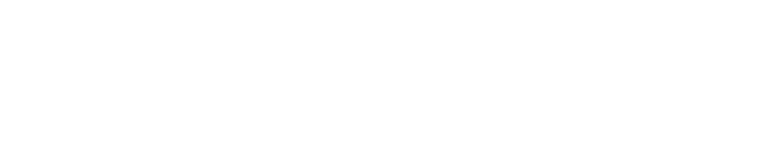

[Logicdan](https://logicdan.com) is a platform for logical tests. The goal of its users is to decipher the relationship between the number and the text presented in each challenge. Once the puzzle is solved, they should deduce the exact text corresponding to the next level.

If the attempt is correct, rewards and progress indicators will be recorded, and a slightly more challenging challenge will be presented. Otherwise, new attempts can be made, or alternatively, the cycle can be restarted, presenting a new sequence of [likely] unprecedented challenges.

Check the following topics for more details about the Logicdan platform:

- [How does it work?](#how-it-works) (detailed explanation)
- [How to get bolts ()?](#how-to-get-bolts)
- [How does Logicdan moderate cheaters?](#how-cheaters-are-moderated)
- [How to propose a good challenge?](#how-to-propose-good-challenges)
- [Glossary](#glossary)

## How does it work?

The main concept to understand is that each Logicdan challenge consists of a set of level and puzzle:

- **Level** is a number from `1` to `9` displayed in the central circle, above the puzzle, between two other circles representing the previous and next levels
- **Enigma** is a text composed of letters, numbers, and/or various characters, displayed prominently in the center of the ranked mode page

Consider the following example:

|   |   |
|---|:-:|
| 1 →|One|
| 2 →| 	? |

This level `1` challenge presents the puzzle `One`. The text that, following the same logic, allows advancing to the next level (in this example `2`) is probably `Two`. Note that the character sequence must follow the same pattern, maintaining the first letter in uppercase.

The complexity of challenges increases as the level number becomes higher. The following example demonstrates this evolution:

|   |   |
|---|:-:|
| 4 →|dw|
| 5 →| 	? |

This level `4` challenge presents the puzzle `dw`. Therefore, it is likely that the text corresponding to level `5`, following the same logic, is `fv`, because "d" is the fourth letter of the Latin alphabet, while "w" is the fourth letter in reverse order.

### Ranked mode

This is the main way to interact with challenges on the Logicdan platform. In the corresponding tab, if logged in, the same challenge will be presented until it is solved or the level is restarted.

Solving a challenge can generate three types of rewards:

- **Bolts **: for each challenge solved above level 2, the reward is 1 bolt. Bolts can be obtained in various ways and can be used to unlock features. [Read the section "How to get bolts" for more information](#how-to-get-bolts).
- **Unlocks **: a number of unlocks equivalent to the level is added for each challenge solved above level 2. The quantity of unlocks for each user is the second criterion in the ranking order.
- **Stars **: the only way to obtain the reward of 1 star is by solving a level 9 challenge. The quantity of stars for each user is the main criterion in the rankings.

Restarting the level may be recommendable if you feel that the difficulty of the current challenge is hindering your progress. Note that restarting the challenge requires bolts (), except for level 1 challenges, due to their didactic and introductory nature. Also, be aware that restarting the challenge when you are already at an advanced level will put you further away from completing a level 9 challenge and obtaining your reward of 1  and 10 .

There are two types of challenges presented in ranked mode: official challenges created by the Logicdan development team and challenges proposed by the community that have been evaluated and approved by moderators.

### Creative mode

Challenges proposed by the community that have not yet been reviewed or have not been approved by moderators can be freely shared and tested. If solved, they do not generate rewards.

## How to get bolts ?

| | |
|:---|:---|
|1 |Solving challenges above level 1|
|10 |Earning  by completing level 9 challenges|
|10 | Having a bug reported, reviewed, and fixed|
|3x |Having proposed challenges approved. x being the challenge level|
|y |Making donations. y being a number between 1 and 250|

Bolts () can be used to restart challenge cycles in ranked mode and submit challenge proposals.

## How cheaters are moderated?

As described on the [terms page](/en/terms), the disclosure, by any means, of resolutions to challenges above level 4, as well as their use for illegitimate progress, is prohibited. Non-compliance with this rule may result in account deactivation.

## How to propose good challenges?

The three main criteria considered in the evaluation of challenges proposed by the community are:

- The registered solution must be consistent with the puzzle text, and the rationale must be satisfactorily free of ambiguities.
- The level of difficulty must correspond to the challenge level.
- The solution applied to the proposed rationale must be immutable. Non-definitive conditions (for example: ranking of most valuable companies in the stock market) should be avoided.

To track the review process, check the status of your challenge on the creative mode screen.

|status|description|
|:---|:---|
|NR|Not Reviewed: once evaluated, another status will be assigned to your challenge|
|RE|Regularized: your challenge has been added to the ranked mode|
|DU|Duplicate: there is another identical one, so it will not be added to the ranked mode|
|NA|Not Approved: the challenge will not be added to the ranked mode|
|XM|Removed: the challenge cannot be tested and shared|

## Glossary

- **Enigma**: encrypted text related to the challenge's level number
- **Level**: number from 1 to 9 representing the challenge difficulty
- **Solution**: text corresponding to the next level, following the same logic that relates the current puzzle to the current level
- **Challenge**: set of level, puzzle, and corresponding solution
- **Cycle**: a sequence of challenges complete, starting from level 1 up to 9
- **Rationale**: description of the logic applied in the challenge
- **Bolts **: reward that unlocks special actions such as submitting challenge proposals and restarting cycles
- **Stars **: the number representing the quantity of cycles a user has completed in ranked gameplay
- **Unlocks **: sum of levels solved by a user (excluding level 1 challenges)
