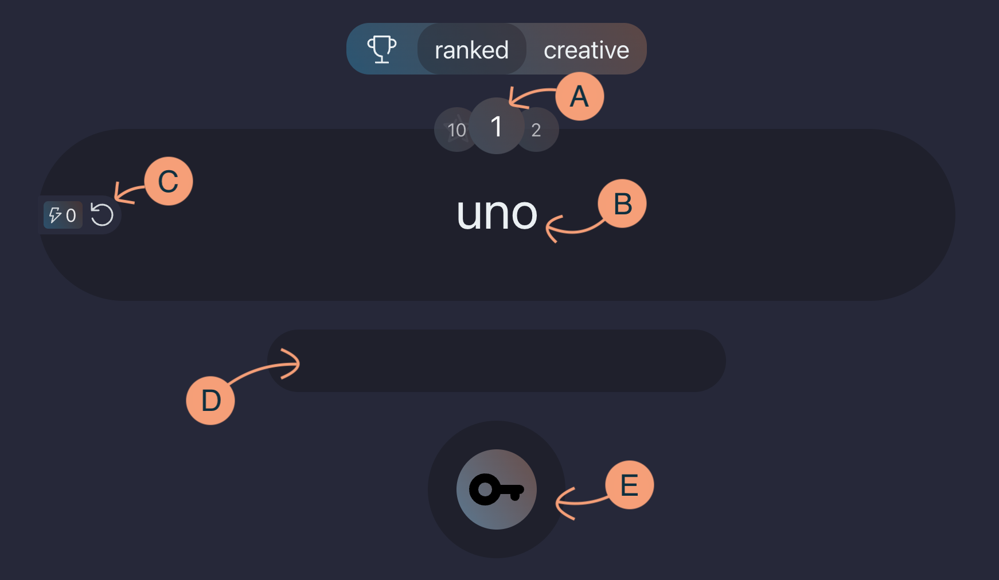

[Logicdan](https://logicdan.com) é uma plataforma de testes lógicos. O objetivo de seus usuários é decifrar a relação entre o número e o texto apresentados em cada desafio. Assim que solucionado o enigma, deverão deduzir qual exato texto correspondente ao nível seguinte.

Se a tentativa estiver correta, recompensas e indicadores de progresso serão registrados, e um desafio de dificuldade ligeiramente maior será apresentado. Caso contrário, novas tentativas podem ser aplicadas, ou, alternativamente, o ciclo pode ser reiniciado, o que apresentará uma nova sequência de desafios [provavelmente] inéditos.

Confira os seguintes tópicos para ler mais detalhes sobre a plataforma Logicdan:

- [Como funciona?](#how-it-works) (explicação detalhada)
- [Como obter bolts ()?](#how-to-get-bolts)
- [Como Logicdan modera trapaceiros?](#how-cheaters-are-moderated)
- [Como propor um bom desafio?](#how-to-propose-good-challenges)
- [Glossário](#glossary)

## Como funciona?

O principal conceito a ser compreendido é que cada desafio de Logicdan é composto por um conjunto de nível e enigma, como explicado abaixo:

- **Nível** A é um número de `1` a `9` exibido no círculo central, acima do enigma. Clique sobre ele para visualizar informações a respeito do desafio apresentado.
- **Enigma** B é um texto composto por letras, números e/ou caracteres diversos.

Considere o seguinte racional:

|   |   |
|---|:-:|
| 1 →|uno|
| 2 →| 	? |

Este desafio de nível `1` apresenta o enigma `uno`. O texto que deve ser inserido no campo de solução D, provavelmente é `dos`. Ao acionar a chave E (clicando sobre ela, ou pressionando a tecla enter), sua cor mudará para tons de verde e um novo desafio do seguinte nível será apresentado.

Note que a solução proposta deve seguir o mesmo padrão lógico, neste caso, a regra mais perceptível é que todas as letras são minúsculas. Caso uma solução incorreta, por exemplo `Dos`, seja inserida no campo de solução D, ao aplicar o teste, a cor da chave E mudará para tons de vermelho e o desafio atual será mantido.

A complexidade dos desafios aumenta na mesma proporção em que o número do nível se torna mais elevado. O racional a seguir demonstra uma evolução de complexidade lógica, proporcional ao nível do desafio:

|   |   |
|---|:-:|
| 4 →|awbXcydz|
| 3 →| 	? |

Este novo desafio hipotético de nível `4` apresenta o enigma `awbXcydz`. O raciocínio a ser decifrado é "as quatro primeiras e quatro últimas letras do alfabeto latino se intercalam formando uma palavra cuja quarta letra é a única maiúscula". Portanto, o raciocínio equivalente ao nível seguinte é "as cinco primeiras e cinco últimas letras do alfabeto latino se intercalam formando uma palavra cuja quinta letra é a única maiúscula" ou seja, `avbwCxdyez`.

### Modo ranqueado

É a principal maneira de interagir com os desafios da plataforma Logicdan. Na aba correspondente, caso esteja logado, um mesmo enigma A será apresentado até que seja resolvido ou que o nível seja reiniciado C.

Resolver um desafio pode gerar três tipos de recompensa:

- **Bolts **: para cada desafio superior ao nível 1 resolvido, a recompensa é de 1 bolt. Bolts podem ser obtidos de diversas maneiras e podem ser utilizados para desbloquear funcionalidades. [Leia a sessão "Como obter bolts" para saber mais](#how-to-get-bolts).
- **Unlocks **: o número de unlocks equivalente ao do nível é somado para cada desafio superior ao nível 2 resolvido. A quantidade de unlocks de cada usuário é o segundo critério na ordenação dos rankings.
- **Stars **: a única maneira de obter a recompensa de 1 star é resolvendo um desafio de nível 9. A quantidade de stars de cada usuário é o principal critério na ordenação dos rankings.

Reiniciar o nível C pode ser recomendável caso você sinta que a dificuldade do desafio atual está impedindo o seu progresso. Note que reiniciar o desafio requer bolts (), exceto em desafios de nível 1, devido ao seu caráter didático e introdutório. Note também que reiniciar o desafio quando você já está em um nível avançado te deixará mais longe de completar um desafio de nível 9 e obter sua recompensa de 1  e 5 .

Existem dois tipos de desafios apresentados no modo ranqueado: os oficiais, criados pela equipe de desenvolvedores; e os desafios propostos pela comunidade que foram avaliados e aprovados por moderadores.

### Modo criativo

Desafios propostos pela comunidade que ainda não foram revisados, ou que não foram aprovados por moderadores, podem ser compartilhados e testados livremente. Se resolvidos, não geram recompensas.

## Como obter bolts ?

| | |
|:---|:---|
|1 |Resolvendo desafios de nível maior que 1|
|5 |Ganhando  ao completar desafios de nível 9|
|10 |Registrando-se na plataforma|
|15 |Tendo bugs reportados, revisados e corrigidos|
|3x |Tendo desafios propostos aprovados. Sendo x o nível do desafio|
|y |Fazendo doações. Sendo y um número entre 1 e 250|

Bolts () podem ser utilizados para reiniciar ciclos de desafios no modo ranqueado e enviar propostas de desafios.

## Como trapaceiros são moderados?

Conforme descrito na [página de termos](/pt/terms), é proibida a divulgação, por qualquer meio, de resoluções dos desafios de nível superior a 4, bem como sua utilização para progresso ilegítimo. O descumprimento desta regra poderá resultar na desativação da conta.

## Como propor bons desafios?

Os três principais critérios considerados na avaliação de desafios propostos pela comunidade são:

- A solução registrada deve ser coerente com o texto do enigma e a explicação descrita deve ser satisfatoriamente livre de ambiguidades;
- O grau de dificuldade deve corresponder ao nível do desafio;
- A solução aplicada para o raciocínio proposto deve ser imutável. Condições não definitivas (por exemplo: ranking de empresas mais valiosas na bolsa de valores), devem ser evitadas;

Para acompanhar o processo de revisão, verifique o status do seu desafio na tela do modo criativo.

|status|descrição|
|:---|:---|
|NR|Não revisado: assim que avaliado, outro status será atribuído ao seu desafio|
|RE|Regularizado: o seu desafio foi adicionado ao modo ranqueado|
|DU|Duplicado: há outro idêntico, por isso, não será adicionado ao modo ranqueado|
|NA|Não aprovado: o desafio não será adicionado ao modo ranqueado|
|XM|Removido: o desafio não poderá ser testado e compartilhado|

## Glossário

- **Enigma** B: texto cifrado relacionado ao número do nível do desafio
- **Nível** A: número de 1 a 9 que representa a dificuldade do desafio
- **Solução** D: texto que corresponde ao nível seguinte, obedecendo à mesma lógica que relaciona o enigma atual com o nível atual
- **Desafio**: conjunto de nível, enigma e solução correspondente
- **Chave** E: botão utilizado para testar uma solução
- **Ciclo**: uma sequência de desafios completa, partindo do nível 1 até o 9
- **Raciocínio**: ou explicação, é a descrição da lógica aplicada no desafio
- **Racional**: é a conjuntura de nível atual, enigma, nível subsequente e incógnita que resulta em uma fórmula similar a [regra de três](https://pt.wikipedia.org/wiki/Regra_de_tr%C3%AAs). Serve para auxiliar o raciocínio através de uma representação visual.
- **Bolts **: recompensa que desbloqueia ações especiais como o envio de propostas de desafios e reinício de ciclos
- **Stars **: é o número que representa a quantidade de ciclos que um usuário já completou no modo de jogo ranqueado
- **Unlocks **: soma dos níveis já solucionados por um usuário (excluindo desafios de nível 1)
